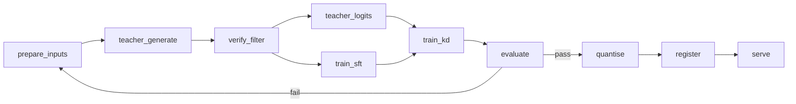
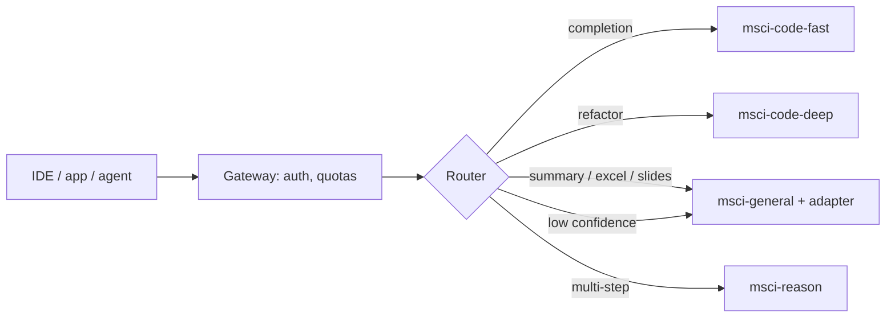
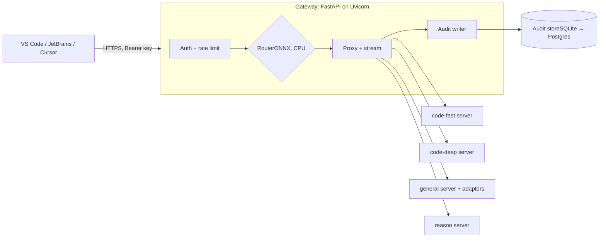

Contents

[Summary](#summary) [Decisions](#decisions) [Catalogue](#catalogue) [Base and teacher choice](#bases) [Distillation methods](#methods) [Model recipes](#recipes) [Pipeline](#pipeline) [T4 budget](#t4) [Evaluation gates](#eval) [Router](#router) [Model store](#serving) [Serving hardware](#hardware) [Gateway and audit](#gateway) [IDE access](#ide) [Data and licensing](#governance) [Colab to cluster](#scale) [Risks](#risks) [Plan](#plan) [Open questions](#open)

Design document · Tech Fest MSCI 2026

# SVLM Model Catalogue

How we build four small vertical language models (two coding, one general purpose, one reasoning) by distilling open-weight teacher models into small instruct checkpoints, first on a single Colab T4 and then on the Kubeflow GPU cluster.

Owner

Mitesh Makhija

Status

Draft v0.2

Date

3 October 2026

Dev compute

Google Colab, 1× T4 16 GB

## 1Summary

The Tech Fest deck describes a catalogue of right-sized models behind one OpenAI-compatible endpoint, each produced by distillation and shipped through one Kubeflow pipeline. This document turns that into an implementable design.

We start from **instruct checkpoints** of open models, use **open-weight teachers we host ourselves** to generate training data, and train the students with QLoRA. Every step is written as a Kubeflow component. On Colab a local runner executes the same components in sequence, so moving to the cluster is a configuration change rather than a rewrite.

#### Goals

- Four catalogue models: `msci-code-fast`, `msci-code-deep`, `msci-general`, `msci-reason`.
- A repeatable pipeline: teacher generation → filtering and verification → training → evaluation → quantisation → registration.
- Each student measured against its teacher and its own untrained base, with a published model card.
- The whole development loop runs on one T4, so anyone at Tech Fest can reproduce it.
- Teammates on the MSCI network use the models from VS Code and JetBrains IDEs through one routed, audited endpoint.

#### Non-goals

- Pretraining from scratch. The existing `building_an_slm_from_scratch.ipynb` covers that for teaching purposes only.
- Training on MSCI data in Colab. Colab is Google-hosted, so the development tier uses public and synthetic data only.
- Matching frontier models in general. Each student targets a narrow job.

## 2Decisions taken

**Starting point**Instruct checkpointsLess data needed, production-realistic. Base checkpoints are only used to explain the concept.

**Teachers**Open-weight, self-hostedApache-2.0 Qwen models. No data leaves our control and same-tokenizer logit distillation becomes possible.

**Dev compute**Colab T4, 16 GBfp16 only (no bf16), so teachers run 4-bit and students train with QLoRA.

**Deliverables**Doc → repo → notebooksThis document, then a code repo of pipeline components, then one Colab notebook per model plus a Tech Fest demo.

**Colab plan**Colab Pro100 compute units a month covers the estimated 50–60 T4 hours. Top up with Pay As You Go if needed. L4 is an option within Pro.

**Weight storage**Drive → local model storeDrive while training; versioned folders in a local model store for serving. Private Hugging Face repo optional.

**Users**Teammates on the MSCI networkOne gateway on an internal Linux server, with per-user keys and a full audit trail.

**IDEs**VS Code, PyCharm, IntelliJ, CursorVS Code and JetBrains through the Continue extension. Cursor needs a security review (see section 14).

## 3The catalogue

Two tiers per model. The **T4 tier** is what we build first and demo. The **cluster tier** is the same recipe at production scale.

| Catalogue name | Job | T4 student | T4 teacher (4-bit AWQ) | Cluster tier |
| --- | --- | --- | --- | --- |
| msci-code-fast | Inline completion, docstrings, unit tests. Sub-second in the IDE. | Qwen2.5-Coder-0.5B-Instruct | Qwen2.5-Coder-14B-Instruct-AWQ | Student 1.5B; teacher Qwen3-Coder-Next (80B-A3B) |
| msci-code-deep | Refactors, multi-function changes, migrations, bug fixes. | Qwen2.5-Coder-1.5B-Instruct | Qwen2.5-Coder-14B-Instruct-AWQ | Student 7B; same cluster teacher |
| msci-general | Summarisation, Excel formulas, slide drafting. One LoRA adapter per vertical. | Qwen3-1.7B | Qwen3-14B-AWQ (non-thinking) | Student Qwen3.5-4B; teacher Qwen3-235B-A22B or Qwen3.6 |
| msci-reason | Multi-step analysis with visible reasoning, including index-methodology arithmetic. | Qwen3-1.7B (stretch: Qwen3-4B) | Qwen3-14B-AWQ (thinking) | Student Qwen3.5-9B; teacher Qwen3-235B-A22B thinking |

All models listed are Apache-2.0. Model availability checked October 2026; confirm exact repository names during the environment smoke test (milestone M0).

## 4Why these bases and teachers

### Qwen3 for the T4 tier, Qwen3.5 for the cluster

The newer Qwen3.5 small models (0.8B–9B, March 2026) are stronger, but they use a hybrid Gated DeltaNet architecture with custom Triton kernels. Unsloth's guidance is that those kernels compile slowly on T4, that Qwen3.5 needs `transformers` v5, and that 4-bit QLoRA training is not recommended for Qwen3.5. A T4 needs QLoRA, so we use standard-transformer Qwen3 and Qwen2.5-Coder on Colab and move to Qwen3.5 with bf16 LoRA on A100/L40S.

### Same tokenizer, teacher and student

Each pair shares a tokenizer: Qwen2.5-Coder-14B with the 0.5B/1.5B coders, and Qwen3-14B with Qwen3-1.7B. That lets us use **logit-level distillation**: the student learns the teacher's full next-token distribution, not just its chosen text. This gets more out of each example, which matters when a Colab session limits us to a few thousand.

### Fill-in-the-middle for code-fast

Inline completion needs fill-in-the-middle (FIM): the model sees code before and after the cursor. Qwen2.5-Coder is trained with FIM tokens (`<|fim_prefix|>`, `<|fim_suffix|>`, `<|fim_middle|>`), and its 0.5B size is what makes sub-second latency realistic.

### Teacher size on a T4

A 14B model in 4-bit AWQ takes about 9–10 GB, which leaves roughly 4 GB for the KV cache under vLLM. That is enough for about 8 parallel sequences of 3k tokens. Qwen3-8B-AWQ (≈6 GB) is the fallback when we need speed over quality. The teacher's quality caps the student's, which is the main reason the cluster tier exists.

## 5Distillation methods

| Method | How it works | Needs | Used by |
| --- | --- | --- | --- |
| **Sequence-level (SFT on teacher text)** | Teacher writes responses; student does supervised fine-tuning on them. | Text only; works across tokenizers. | All four, as the first stage |
| **Verified rejection sampling** | Teacher samples several answers; keep only those a checker accepts (tests pass, number matches, formula evaluates). | An automatic checker. | code-deep, reason, general/Excel |
| **Offline logit distillation** | Teacher re-reads the kept examples and we save its top-20 token probabilities. Student trains on a mix of cross-entropy and KL divergence against them. | Shared tokenizer; ≈120 bytes per token of storage. | reason, code-fast |
| **On-policy distillation (GKD)** | Student generates, teacher scores each token, student corrects. Fixes exposure bias. | Teacher and student on the GPU at once. | Cluster tier only. Both models together do not fit a T4. |

Logit loss for the offline method, with mixing weight α ≈ 0.5 and temperature T = 1:

```
loss = α · CE(student, teacher_text)
     + (1 − α) · KL( p_teacher_top20 ‖ p_student restricted to the same 20 tokens, renormalised )
```

## 6Model recipes (T4 tier)

### msci-code-fast

- **Inputs:** Python files from permissively licensed repositories (MIT/Apache/BSD; for example pandas, NumPy, scikit-learn), split into FIM examples at random spans: line, block and function-body level.
- **Teacher step:** the 14B coder writes the middle span and docstrings/tests for selected functions. Keep a span only if it parses (`ast.parse`) and its tokens are close to the original span. The original code is also kept as a training target.
- **Volume:** ≈6,000 FIM examples plus ≈2,000 short instructions (docstring, test, one-line fix). Max sequence 1,024.
- **Training:** QLoRA r=16, SFT then one epoch of offline logit distillation.
- **Eval:** exact-match and edit similarity on 500 held-out FIM spans, HumanEval+ pass@1, latency to first token.

### msci-code-deep

- **Inputs:** MBPP train prompts plus teacher-written problems seeded from real functions in the same repositories (OSS-Instruct style), with emphasis on data-handling code.
- **Teacher step:** for each problem the teacher writes 4 candidate solutions and a test file. Run everything in a sandbox (subprocess, 10 s timeout, no network). Keep solutions that pass the tests most candidates agree on. This guards against wrong teacher tests.
- **Volume:** ≈3,000 verified solutions with short explanations. Max sequence 2,048.
- **Training:** QLoRA r=32, SFT.
- **Eval:** HumanEval+ and MBPP+ (EvalPlus), plus 150 held-out refactor tasks scored by tests.

### msci-general

One shared student with three LoRA adapters, served together through vLLM multi-LoRA.

| Adapter | Public input data | Teacher output | Automatic check | Examples |
| --- | --- | --- | --- | --- |
| summarise | SEC EDGAR filings (MD&A sections, earnings releases; US public domain) | 3-bullet and 1-paragraph summaries | Length and format rules; every number in the summary must appear in the source | 1,500 |
| excel | Synthetic tables generated by script (prices, holdings, returns) | Formula plus one-line explanation | Formula evaluated with the `formulas` library and compared to the pandas answer | 1,500 |
| slides | Paragraphs from the same filings | Slide title, 3–5 bullets, speaker notes | Schema check, then teacher judging against a rubric | 1,500 |

Training uses QLoRA r=16 per adapter with max sequence 2,048, and Qwen3's non-thinking mode (`/no_think`). Evaluation covers the per-adapter checks above on 200 held-out items each, pairwise teacher-judged win rate against the teacher's own answer, and IFEval to confirm general instruction following has not regressed.

### msci-reason

- **Inputs:** GSM8K and MATH training problems (MIT licence), plus a **synthetic index-methodology generator** written in Python. It produces word problems with exact answers: cap-weighted constituent weights, 10/40 capping, rebalance turnover, chain-linked index levels, and total versus price return with dividends.
- **Teacher step:** Qwen3-14B in thinking mode, 4 samples per problem, max 4,096 tokens. Keep traces whose final answer matches the ground truth, then keep the shortest correct trace. This limits verbosity and helps latency.
- **Volume:** ≈2,500 traces, about 40% of them from the index generator.
- **Training:** QLoRA r=32, max sequence 4,096, SFT then offline logit distillation on the same traces. Optional later: GRPO against the same answer checker.
- **Eval:** GSM8K test, a 200-problem MATH-500 subset, 300 held-out index problems, and average reasoning length.

## 7Pipeline

One pipeline definition with a config file per model. Each box is a Kubeflow component with typed inputs and outputs. On Colab, `run_local.py` calls them in order and writes artefacts to Google Drive.



| Component | Does | Output artefact | T4 time (estimate) |
| --- | --- | --- | --- |
| prepare_inputs | Collect, dedupe, split train/held-out, remove overlap with eval sets (13-gram check) | `inputs.jsonl` | \< 10 min |
| teacher_generate | vLLM batch generation with the 4-bit teacher, sharded and resumable | `teacher_raw/*.jsonl` | 1–4 h per model |
| verify_filter | Run checkers (parse, tests, answer match, formula eval), dedupe | `train.jsonl` + filter report | 10–30 min |
| teacher_logits | Teacher re-reads kept examples (prompt logprobs, top-20) | `logits/*.npz` | 20–60 min |
| train_sft / train_kd | Unsloth QLoRA in fp16 with gradient checkpointing and packing | LoRA adapter | 30–90 min |
| evaluate | Benchmarks, task suites, teacher judging, latency | `metrics.json` + gate verdict | 20–40 min |
| quantise | Merge adapter, export AWQ 4-bit (vLLM) and GGUF Q4_K_M (laptops) | Quantised weights | 10–20 min |
| register | Write model card, version, lineage (data hash, config, git commit) | Registry entry | \< 1 min |

Times are planning estimates for ≈2–6k examples. Milestone M0 replaces them with measured throughput.

## 8T4 budget

### Memory

| Phase | Model | Weights | Remaining for | Fit |
| --- | --- | --- | --- | --- |
| Teacher generation | Qwen3-14B-AWQ | ≈9.5 GB | KV cache ≈4 GB (≈160 KB per token → \~25k tokens in flight) | fits |
| Teacher generation | Qwen2.5-Coder-14B-AWQ | ≈9.5 GB | KV cache ≈4 GB (≈190 KB per token → \~20k tokens) | fits |
| Student QLoRA | Qwen3-1.7B, seq 4,096 | ≈1.3 GB | Activations with checkpointing, optimiser state for LoRA only | fits |
| Student QLoRA | Qwen3-4B, seq 4,096 | ≈2.8 GB | Batch size 1 with gradient accumulation | tight |
| Online distillation | 14B teacher + 1.7B student | ≈11 GB+ | Two models plus activations | no |

Phases run one after another. Each saves its output and frees the GPU before the next one loads.

### Working within Colab limits

- **No bf16:** load everything in fp16 or 4-bit. Set `dtype=float16` explicitly in vLLM and Unsloth.
- **Disconnects:** generation writes shards of 200 examples and skips finished shards on restart. Training saves a checkpoint every 100 steps to Drive.
- **Library drift:** pin vLLM, Unsloth, transformers and TRL versions after M0 passes. Keep a Hugging Face `generate` fallback in `teacher_generate` in case a vLLM release breaks on sm_75.
- **Session length:** Colab Pro sessions last up to 24 hours. Each phase fits in one session, and resumable chunks cover disconnects.

### Compute-unit budget (Colab Pro)

| Work | T4 hours |
| --- | --- |
| M0 smoke test and throughput measurement | ≈2 |
| Teacher generation, 4 models | ≈12 |
| Teacher probabilities for logit distillation | ≈3 |
| 6 training runs (general has 3 adapters) | ≈9 |
| Evaluation, quantisation, router | ≈5 |
| **Planned total / with re-runs** | **≈30 / 50–60** |

A T4 uses roughly 1.2–2 compute units per hour. Google does not publish exact rates, so read the real figure from the Colab Resources panel during M0. 100 units covers most or all of the plan.

## 9Evaluation and release gates

Every student is compared with two references: its teacher (the ceiling) and its own untrained instruct checkpoint (the floor). A model is registered only if all gates pass. Thresholds below are T4-tier starting points; the team agrees final values after the first run.

| Gate | Rule | Applies to |
| --- | --- | --- |
| Task quality vs teacher | Student ≥ 85% of teacher score on its held-out task suite | All |
| Lift over base | Student beats its untrained checkpoint on the task suite | All |
| No general regression | IFEval drops by no more than 3 points versus base | All |
| Format validity | ≥ 98% of outputs parse or match the schema (code parses, formula evaluates, slide JSON valid) | All |
| Latency on T4 | Time to first token: code-fast \< 150 ms, general \< 400 ms; reason reported, not gated | code-fast, general |
| Reasoning length | Average trace ≤ 1.2× the teacher's average for correct answers | reason |
| Safety | Passes a small suite: refuses to reveal secrets or PII, resists prompt injection in inputs, no harmful code | All |

Teacher judging is biased toward the teacher's own style, so it is never the only signal. Every adapter also has an exact or automatic check.

## 10Router

The deck's router is a small encoder classifier in front of the catalogue. We get its training data for free: every prompt in the four training sets already carries its model label.

- **Model:** ModernBERT-base or DeBERTa-v3-small, fine-tuned on T4 in minutes.
- **Labels:** `code-fast`, `code-deep`, `general/summarise`, `general/excel`, `general/slides`, `reason`.
- **Fallback:** when confidence is below 0.6, send the query to `msci-general`. Log the predicted label, confidence, chosen model and latency for every request, and use those logs to retrain.



## 11Model store and versioning

### Three storage layers

| Layer | Holds | Purpose |
| --- | --- | --- |
| Google Drive | Shards, checkpoints, adapters, logs | Working storage while Colab runs. Survives disconnects. |
| Local model store | Released, quantised weights plus model card | What the gateway serves. Synced from Drive (Google Drive for Desktop or zip download), then copied to the gateway server. |
| Private Hugging Face repo (optional) | Same as the model store | Versioned registry that teammates can pull from. Use only if MSCI policy allows uploads. |

```
model_store/
  msci-code-fast/0.1.0-t4/    model.Q4_K_M.gguf   awq/   model_card.md   metrics.json
  msci-code-deep/0.1.0-t4/
  msci-general/0.1.0-t4/      base.Q4_K_M.gguf    adapters/{summarise,excel,slides}   ...
  msci-reason/0.1.0-t4/
  router/0.1.0/               router.onnx   labels.json
  catalogue.yaml              # which version of each model is live
```

The full catalogue is about 6–8 GB on disk: ≈0.4 GB for code-fast, ≈1–1.2 GB for each 1.5–1.7B model, and adapters of 20–100 MB each. `catalogue.yaml` is the single switch for promotion and rollback. The gateway reads it on start-up and on a reload call.

### Naming and versions

The format is `<name>:<major.minor.patch>-<tier>`, for example `msci-reason:0.1.0-t4`. Increase minor for a new data or recipe version and patch for a re-run with fixes.

### Model card fields

```
name, version, tier, owner
base_model, teacher_model, distillation_method
train_data: sources, licences, row counts, sha256
eval: task suite, benchmarks, teacher score, base score, gate verdicts
serving: quantisation, max_context, recommended_temperature, latency_p50
limitations, intended_use, out_of_scope_use
lineage: git_commit, pipeline_run_id, config_hash
```

## 12Serving hardware

A GPU is required for training, not for serving. Once trained and quantised, these models are small enough to run on CPU. The question is how many teammates use them at once, and whether they use tab-completion, which fires every time a developer pauses typing.

| Option | Runtime | Comfortable load | Expected latency (estimate) |
| --- | --- | --- | --- |
| **CPU server** Linux VM, 16 vCPU, 32 GB RAM | llama.cpp, GGUF Q4 | Pilot of about 5–10 users, mostly chat | Chat and summaries: first token 0.5–2 s, then 20–40 tokens/s (1.7B). Tab-completion: borderline under load. Reasoning: 30–90 s per answer. |
| **GPU server** Linux VM, 1× L4 24 GB or T4 16 GB | vLLM, AWQ 4-bit | Team-wide, 50+ users | Tab-completion: first token under 150 ms. Chat: under 400 ms. Reasoning: 5–15 s. All models stay loaded together (≈6 GB of weights). |

**Recommendation:** start the pilot on a CPU VM, measure, then add one small GPU when tab-completion use grows. The gateway talks to model servers over HTTP, so the switch is a config change: `backend: llamacpp` becomes `backend: vllm`. Use an internal Linux server rather than a Windows laptop. A laptop sleeps, sits behind a local firewall, and vLLM does not run on Windows.

Latency figures are planning estimates. Milestone M6 benchmarks the actual server with realistic IDE traffic.

## 13Gateway, router and traceability

One FastAPI application served by Uvicorn. It handles authentication, routing and auditing. Inference runs in separate model-server processes, so the gateway stays stateless and can run several Uvicorn workers.



### API

| Endpoint | Use |
| --- | --- |
| GET /v1/models | Lists catalogue models plus `msci-auto`. IDEs use it to fill their model pickers. |
| POST /v1/chat/completions | Chat, with streaming (SSE). `model: msci-auto` sends the request through the router; a named model skips the router. |
| POST /v1/completions | Fill-in-the-middle tab-completion (`prompt` + `suffix`). Always goes to `msci-code-fast`. |
| GET /health, /metrics | Liveness and Prometheus metrics. |
| /admin/\* | Issue or revoke keys, reload `catalogue.yaml`, search the audit log. Admin role only. |

### Identity and access

- Each teammate gets a personal API key from an admin CLI. Only a hash is stored. Each key carries user ID, team and allowed models.
- HTTPS with an internal certificate, bound to the MSCI network only. Per-user rate limits.
- Later: replace keys with MSCI single sign-on tokens (OIDC). The audit schema does not change.

### What every request records

| Field | Example |
| --- | --- |
| request_id | UUID, also returned to the caller in the `X-Request-ID` header |
| ts_start, ts_end | UTC timestamps |
| user_id, team, key_id | From the API key |
| client, client_ip | IDE and extension version from the User-Agent, source address |
| endpoint, model_requested | `/v1/chat/completions`, `msci-auto` |
| router_label, router_confidence | `reason`, 0.87 (empty if the router was skipped) |
| model_served, model_version | `msci-reason`, `0.1.0-t4` |
| prompt, response | Full text, masked text or SHA-256 hash only, set by policy |
| tokens_in, tokens_out | Token counts |
| ttft_ms, total_ms, status | Latency and outcome (ok, error, rate_limited, blocked) |
| prev_hash, row_hash | Hash chain: each row includes the previous row's hash, so editing or deleting a row is detectable |

- Audit writes are asynchronous, so logging does not add latency to the response.
- PII masking (emails, phone numbers, account-like numbers) runs before anything is stored when the policy is `masked`.
- The audit store holds teammates' code and prompts. It is access-controlled, encrypted at rest and kept for an agreed retention period (proposed 90 days).
- The admin page searches by user, team, model, date or request ID and exports to CSV. The same logs retrain the router.

## 14IDE access

| IDE | How | Chat | Tab-completion |
| --- | --- | --- | --- |
| VS Code | Continue extension, shared `config.yaml` | yes | yes via FIM |
| PyCharm, IntelliJ | Continue plugin for JetBrains, same `config.yaml` | yes | yes via FIM |
| Cursor | Settings → Models → override OpenAI base URL | needs review | no |

### Shared Continue profile

```
name: MSCI Model Catalogue
version: 0.1.0
schema: v1
models:
  - name: MSCI Auto
    provider: openai
    model: msci-auto
    apiBase: https://<gateway-host>/v1
    apiKey: ${{ secrets.MSCI_SVLM_KEY }}
    roles: [chat, edit, apply]
  - name: MSCI Code Deep
    provider: openai
    model: msci-code-deep
    apiBase: https://<gateway-host>/v1
    apiKey: ${{ secrets.MSCI_SVLM_KEY }}
    roles: [chat, edit]
  - name: MSCI Code Fast
    provider: openai
    model: msci-code-fast
    apiBase: https://<gateway-host>/v1
    apiKey: ${{ secrets.MSCI_SVLM_KEY }}
    roles: [autocomplete]
```

### Cursor limitations

- Cursor sends custom-model requests through its own cloud servers, so an internal-only gateway URL is unreachable from Cursor. Supporting Cursor would mean exposing the gateway to the internet, which needs an MSCI security review.
- Cursor's tab-completion does not accept custom models, only chat and agent features.
- Plan: VS Code and JetBrains first. Cursor only if security approves an externally reachable endpoint.

## 15Data and licensing

| Item | Licence / status | Action |
| --- | --- | --- |
| Qwen3, Qwen2.5-Coder students and teachers | Apache-2.0 | cleared Record in model card |
| GSM8K, MATH | MIT | cleared |
| MBPP | CC-BY-4.0 | cleared Attribution in model card |
| SEC EDGAR filings | US government public records | cleared Respect SEC access rate limits |
| Code from MIT/Apache/BSD repositories | Per repository | check Keep licence file and commit hash per repo |
| Pre-distilled reasoning datasets (e.g. Mixture-of-Thoughts) | Not clearly stated on the dataset page | excluded Until legal review |
| MSCI internal code, research and client data | Confidential | cluster only Never in Colab |

The rule from the deck still applies: the student inherits the teacher's mistakes. That is why every recipe has an automatic checker and why we keep the filter reports (how many teacher outputs were rejected and why) with each dataset version.

## 16From Colab to the cluster

| Dimension | T4 tier | Cluster tier |
| --- | --- | --- |
| Compute | 1× T4 16 GB, fp16 | A100 / L40S pool, bf16 |
| Teachers | 14B, 4-bit AWQ | Qwen3-235B-A22B, Qwen3.6, Qwen3-Coder-Next |
| Students | 0.5B–1.7B (4B stretch) | Qwen3.5 2B / 4B / 9B, Qwen2.5-Coder-7B |
| Training | QLoRA | bf16 LoRA or full fine-tune; on-policy distillation; GRPO |
| Data | Public and synthetic, 2–6k examples per model | Curated, redacted MSCI data, 50–200k examples per model |
| Orchestration | `run_local.py` calling components | Same components compiled with the KFP SDK, triggered by merge or schedule |
| Registry / serving | Drive + MLflow + private HF repo; vLLM on the T4 | Model registry; KServe + vLLM; gateway and router |

The components, configs, checkers and model card format do not change. Only the config values and the runner change.

## 17Risks and mitigations

| Risk | Impact | Mitigation |
| --- | --- | --- |
| A 14B teacher limits student quality | medium | Verified filtering; report the teacher ceiling openly; cluster tier for production quality |
| vLLM or Unsloth release breaks on T4 | medium | Pin versions after M0; Hugging Face `generate` fallback |
| Colab disconnects lose work | medium | Sharded, resumable generation; frequent checkpoints to Drive |
| Eval contamination inflates scores | high | 13-gram overlap removal against all eval sets before training |
| Teacher writes wrong tests or answers | medium | Agreement across 4 samples; ground truth where available |
| Reasoning traces too long for latency | medium | Keep shortest correct trace; length gate |
| Student loses general ability | medium | LoRA rather than full fine-tune; mix 10% general instruction data; IFEval gate |
| CPU serving too slow for tab-completion | medium | Pilot measures it; backend switch to a single L4/T4 GPU without gateway changes |
| Audit log exposes sensitive code or prompts | high | Masking or hash-only policy, access control, encryption at rest, fixed retention |
| Cursor needs an internet-reachable endpoint | medium | VS Code and JetBrains first; Cursor only after security review |
| Dataset licence issue found late | high | Licence column in every data manifest; anything unclear is excluded by default |

## 18Delivery plan

| Milestone | Outcome | Deliverable |
| --- | --- | --- |
| M0 | Colab environment works: teacher loads in vLLM on T4, a 1.7B QLoRA step runs, throughput measured, versions pinned | Smoke-test notebook |
| M1 | `msci-code-fast` end to end. It is the smallest model and proves every component. | Repo v0.1 + notebook 1 |
| M2 | `msci-general` with three adapters, plus the router | Notebook 2 |
| M3 | `msci-reason` with the index generator and logit distillation | Notebook 3 |
| M4 | `msci-code-deep` with sandboxed test verification | Notebook 4 |
| M5 | Gateway on an internal Linux VM: router, per-user keys, audit log, admin page; Continue profiles for VS Code and JetBrains | Gateway service + IDE profiles |
| M6 | Pilot with a few teammates; benchmark CPU serving under real IDE traffic and decide on adding a GPU | Pilot report |
| M7 | Tech Fest demo: one notebook that distils a tiny student live in \~20 minutes using cached teacher outputs, then calls it through the gateway from VS Code; KFP pipeline compiles to YAML | Demo notebook + pipeline YAML |

### Repository layout

```
svlm-catalogue/
  configs/            code_fast.yaml  code_deep.yaml  general.yaml  reason.yaml
  components/         prepare_inputs.py  teacher_generate.py  verify_filter.py
                      teacher_logits.py  train_sft.py  train_kd.py  evaluate.py
                      quantise.py  register.py
  checkers/           code_exec.py  fim_parse.py  excel_formula.py  answer_match.py
  generators/         index_math.py  excel_tables.py
  router/             train_router.py  export_onnx.py
  pipelines/          kfp_pipeline.py  run_local.py
  gateway/            app.py  routing.py  auth.py  audit.py  backends/{llamacpp,vllm}.py  admin.py
  deploy/             catalogue.yaml  systemd/  docker-compose.yaml
  ide/                continue/config.yaml  README.md
  notebooks/          00_smoke_test  01_code_fast  02_general  03_reason  04_code_deep  techfest_demo
  model_cards/        template.md
```

## 19Open questions

1. Is a personally paid Colab Pro account acceptable under MSCI policy for public-data work, or should it be procured centrally?
2. Which internal Linux VM hosts the gateway, and who issues its internal TLS certificate?
3. Audit policy: full prompts, masked prompts or hashes only, and the retention period?
4. Is a private Hugging Face repository allowed, or does the model store stay internal only?
5. Who signs off licence clearance for the public code repositories and any pre-distilled datasets?
6. Which real MSCI tasks are first in line for the cluster tier, and who owns their held-out evaluation sets?
7. Tech Fest date, which sets the deadline for M5.

---

Sources: [Unsloth, Qwen3.5 fine-tuning guide](https://unsloth.ai/docs/models/qwen3.5/fine-tune) · [Unsloth, Qwen3 run and fine-tune](https://unsloth.ai/docs/models/tutorials/qwen3-how-to-run-and-fine-tune) · [Qwen model families, mid-2026](https://insiderllm.com/guides/qwen-models-guide/) · [Qwen3.5 small models release](https://www.marktechpost.com/2026/03/02/alibaba-just-released-qwen-3-5-small-models-a-family-of-0-8b-to-9b-parameters-built-for-on-device-applications/) · [vLLM on T4 (sm_75)](https://www.speediyo.com/ai-infra/vllm-v100-t4-sm70-sm75-fallback) · [Mixture-of-Thoughts dataset](https://huggingface.co/datasets/open-r1/Mixture-of-Thoughts)